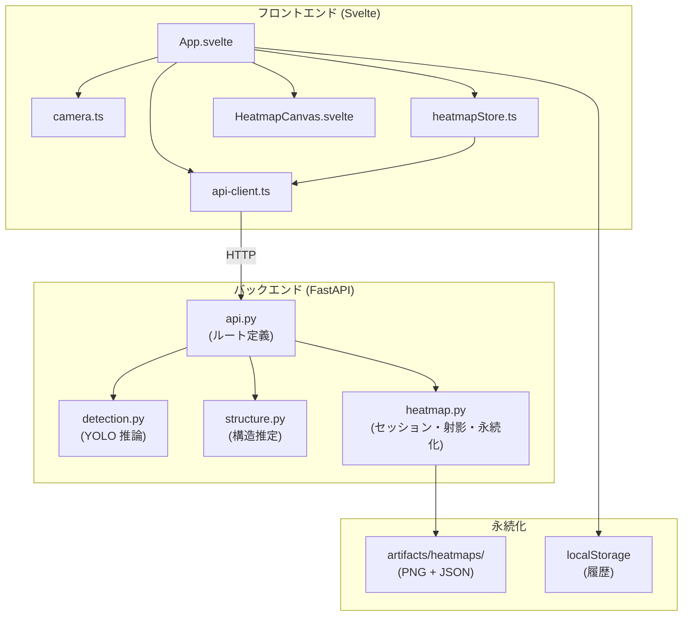
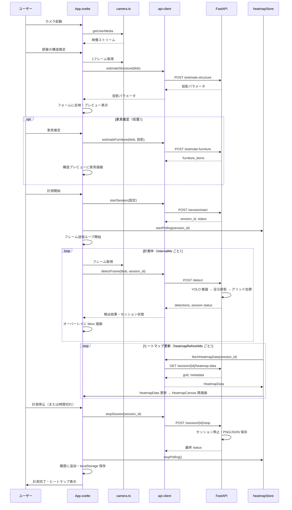
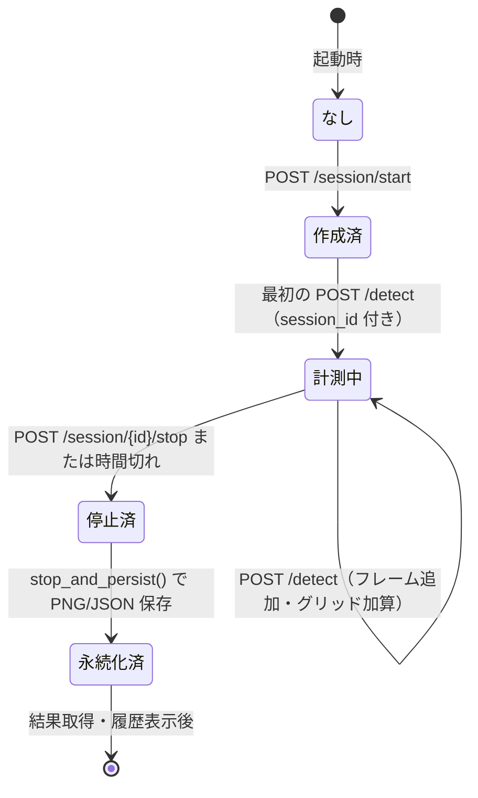
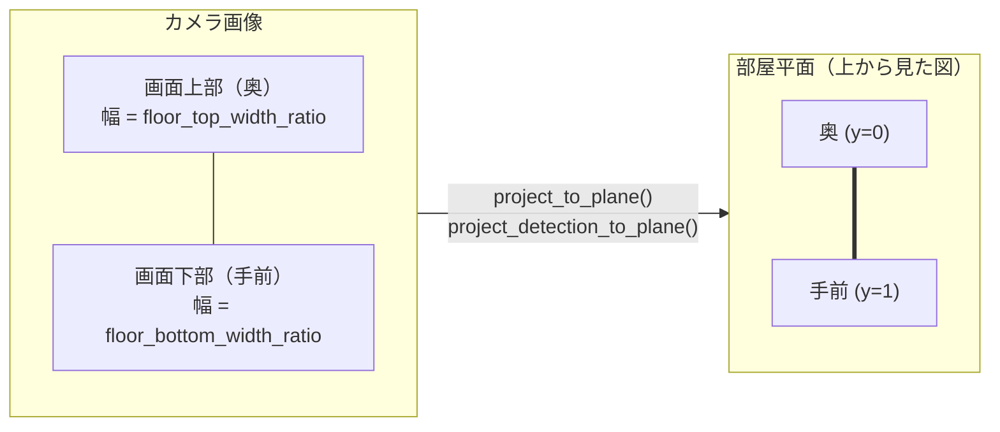
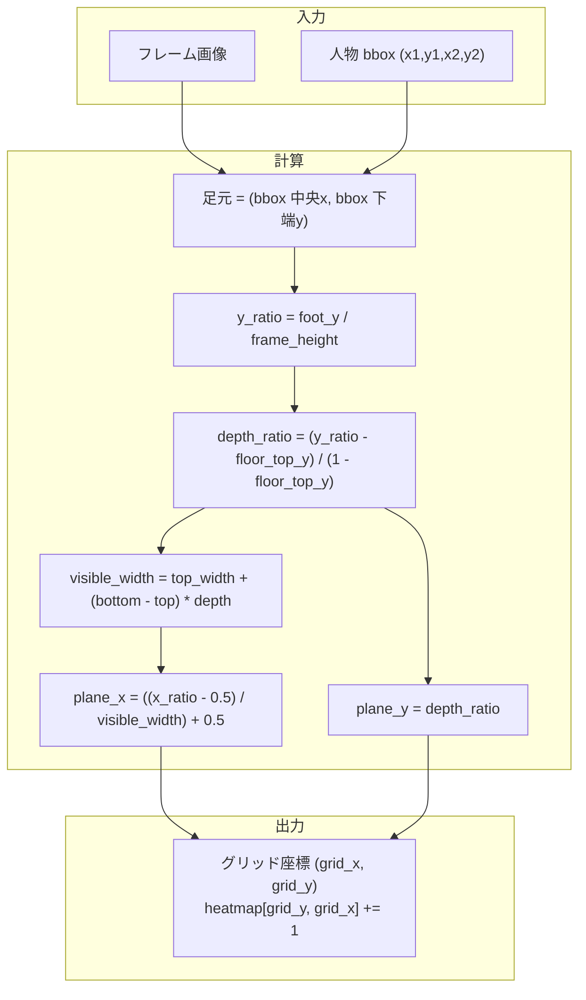
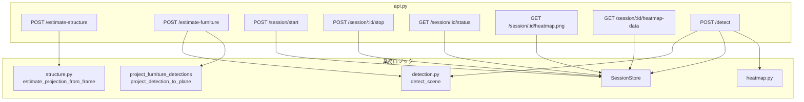
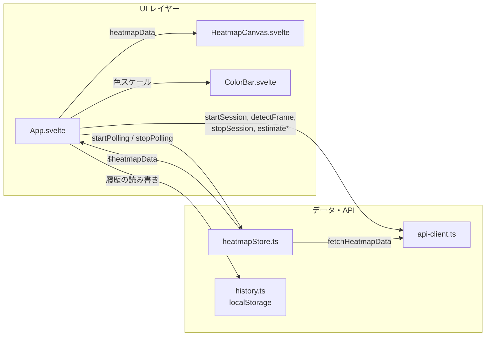

# YOLO Detection プロダクト 仕組みとワークフロー

このドキュメントでは、YOLOv8 を用いた人物滞留ヒートマップ PoC の**動く仕組み**を、図解（Mermaid）を交えて説明します。

---

## 1. プロダクト概要

ブラウザのカメラ映像から **人物（person）** を検出し、足元位置を**床面へ射影**して、部屋平面の**滞留ヒートマップ**を生成するアプリケーションです。

- **バックエンド**: FastAPI（Python）+ YOLOv8（Ultralytics）
- **フロントエンド**: Svelte 5 + TypeScript + Vite
- **計測**: セッション単位で開始・停止し、指定時間（例: 60分）の間、定期的にフレームを送信してヒートマップを蓄積

---

## 2. システムアーキテクチャ

**依存の向き（責務の分離）:**

- `main.py` → FastAPI の生成・静的ファイルマウント・ルート登録のみ
- `api.py` → HTTP の入出力と、detection / structure / heatmap の**呼び出し**
- 推論・構造推定・セッション管理は API 層に引きずられない形でモジュール化

---

## 3. エンドツーエンド ユーザーワークフロー

利用者が「カメラ起動」から「計測完了・履歴確認」まで行う一連の流れです。

---

## 4. セッションライフサイクル

計測の「開始」から「停止・永続化」までの状態遷移です。

**状態の意味:**

| 状態       | 説明 |
|------------|------|
| なし       | セッション未作成 |
| 作成済     | セッション ID が発行されたが、まだ `/detect` でフレームが来ていない |
| 計測中     | `is_active === true`。`/detect` でフレームを受け取り、ヒートマップグリッドを更新 |
| 停止済     | `ended_at` が設定された。残り時間切れまたは明示的停止 |
| 永続化済   | `artifacts/heatmaps/` に PNG と JSON が保存された |

**永続化のタイミング:**  
`POST /session/{id}/stop` または、`GET /session/{id}/status` で `is_active === false` と判明したときに `stop_and_persist()` が呼ばれ、その時点で PNG/JSON が書き出されます。

---

## 5. 床面射影モデル（投影の仕組み）

カメラ画像上の「足元」を、部屋を上から見た**平面座標（0〜1 の長方形）**に写すためのモデルです。

### 5.1 パラメータの意味

- **floor_top_y_ratio**: 画像の中で「床が始まる」とみなす Y 位置（0〜1）。これより上は床として扱わない。
- **floor_top_width_ratio**: 奥側（画面上部）の床の**見かけの幅**（画像幅に対する比）。
- **floor_bottom_width_ratio**: 手前側（画面下部）の床の見かけの幅。通常 1.0（画面幅いっぱい）。

画像上では奥に行くほど幅が狭く見えるため、**台形**の床領域を、**長方形の部屋平面**に射影します。

### 5.2 射影の流れ（人物の足元）

- 足元が `floor_top_y_ratio` より上にある場合は射影せず無視します。
- 平面座標 (plane_x, plane_y) をグリッド番号に変換し、`HeatmapSession.heatmap` の該当セルを加算します。

---

## 6. バックエンド リクエストフロー

主要 API ごとに、リクエストがどのモジュールを経由するかを示します。

- **POST /detect**: 画像をデコード → `detector.detect_scene()` → `session.add_frame()`（足元射影・グリッド加算・家具マージ）→ セッション状態を返却。
- **POST /session/start**: `SessionStore.create()` で `HeatmapSession` を生成し、ID と status を返却。
- **POST /session/:id/stop**: `SessionStore.stop_and_persist()` で `session.stop()` と `persist_artifacts()` を実行。

---

## 7. フロントエンドのデータフロー

フロントエンド内で、セッション・ヒートマップ・API がどう連携するかを示します。

- **計測中**: App が `detectFrame()` を一定間隔で呼び出し、同じ `session_id` で `HeatmapStore` が `fetchHeatmapData()` をポーリング。取得した `HeatmapData` が `HeatmapCanvas` に渡され、部屋外形・グリッド・家具が描画されます。

---

## 8. API 一覧（参照）

| メソッド | パス | 役割 |
|----------|------|------|
| GET | `/` | フロントエンド index.html |
| GET | `/health` | 稼働・モデル名確認 |
| POST | `/estimate-structure` | 1 フレームから床・投影パラメータを推定 |
| POST | `/estimate-furniture` | 1 フレーム + 投影から家具を部屋座標で取得 |
| POST | `/session/start` | セッション作成（時間・部屋サイズ・投影パラメータ） |
| POST | `/session/{id}/stop` | セッション停止と PNG/JSON 永続化 |
| GET | `/session/{id}/status` | 残り時間・検出数・家具など |
| GET | `/session/{id}/heatmap.png` | ヒートマップ画像（PNG） |
| GET | `/session/{id}/heatmap-data` | ヒートマップグリッド・メタデータ（JSON） |
| POST | `/detect` | 画像 + 任意で session_id。YOLO 推論とセッション更新 |

---

## 9. 関連ドキュメント

- [README.md](../README.md) … セットアップ・起動・機能概要
- [architecture.md](./architecture.md) … モジュール構成・責務・依存の向き
